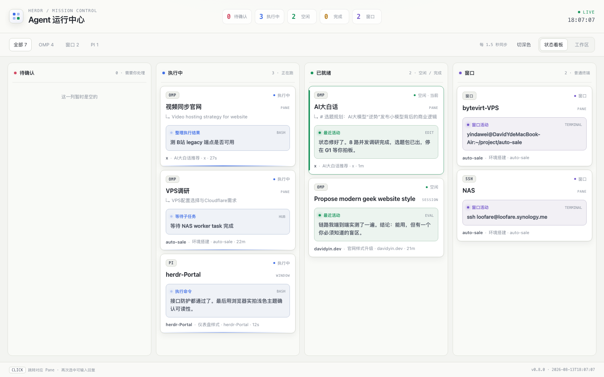

# herdr-portal

**HERDR 全局看板** — 把当前 Herdr 会话里的全部 workspace / tab / pane 聚合成一块实时看板。

- **TUI 看板**（`prefix+a`）：Mission Control 风格，Agent 三列 + 窗口独立视图，回车直达会话
- **网页大屏**（`prefix+shift+a`）：浅/深主题、结构化进展、点卡片定位 Herdr 并弹终端到前台、网页端直接回复 Agent、最近输出 Markdown 渲染



## 功能

- **聚合所有 Agent 状态**：待确认 / 执行中 / 空闲 / 已完成（待确认列为空时自动隐藏）
- **Agent 类型**：PI、OMP、Claude、Codex 等 20+ 种
- **结构化实时进展**：当前阶段 + 执行标题 + 工具类型 + 最近活动时间
- **窗口独立视图**：SSH / Shell 普通终端不占主看板
- **网页端回复**：选中 Agent 后点 ↩，输入框回车直发到该 Agent 终端（空闲走 `agent prompt`，执行中模拟键盘输入）
- **点击定位**：网页/TUI 点卡片 → Herdr 切到对应工作区/Tab/Pane，并把承载 Herdr 的终端窗口带到前台（自动识别 Ghostty / iTerm2 / Terminal / kitty 等）
- **稳定**：网页服务独立于 Herdr 运行（关 popup 不断线）、断线保留数据自动重连、滚动位置保持、数据指纹跳过无效重渲染

## 安装

```bash
herdr plugin install <owner>/herdr-portal
```

然后绑定快捷键（`~/.config/herdr/config.toml`）：

```toml
[[keys.command]]
key = "prefix+a"
type = "plugin_action"
command = "herdr-portal.open-board"
description = "open global board TUI"

[[keys.command]]
key = "prefix+shift+a"
type = "plugin_action"
command = "herdr-portal.open-web"
description = "open web portal"
```

`herdr server reload-config` 后即可使用。

### 本地开发

```bash
herdr plugin link /path/to/herdr-portal
herdr server reload-config
```

## 按键

TUI：

| 键 | 作用 |
| --- | --- |
| `↑↓←→` / `hjkl` | 选择卡片 |
| `Enter` | 跳转到该 Pane 并关闭面板 |
| `Tab` / `v` | Agent 看板 ↔ 窗口视图 |
| `1-3` | 直选列 |
| `r` / `q` | 刷新 / 退出 |

网页：点卡片 = 定位 Herdr；点卡片右上角 ↩ = 展开回复区（Enter 发送 / Shift+Enter 换行 / Esc 关闭）。

## 要求

- herdr 0.7+
- Python 3.9+（macOS 自带，Linux 需安装）
- 网页大屏需要浏览器（Chrome / Safari / Edge 均可，自动复用已打开的标签页）

## 环境变量

| 变量 | 作用 |
| --- | --- |
| `HERDR_PORTAL_PORT` | 网页端口（默认 8787） |
| `HERDR_PORTAL_NO_FRONT=1` | 点击卡片时不让终端窗口弹到前台 |

服务管理：`python3 board/daemon.py start|stop|restart|status`（网页服务由插件自动拉起）。
