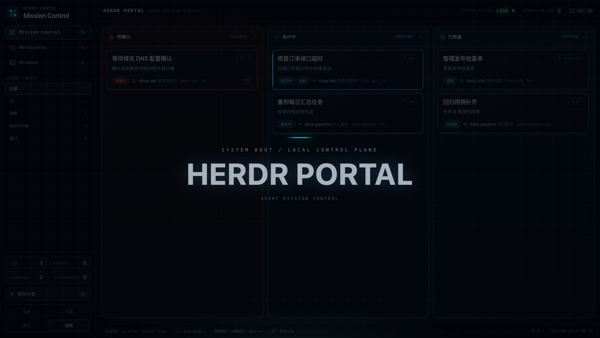
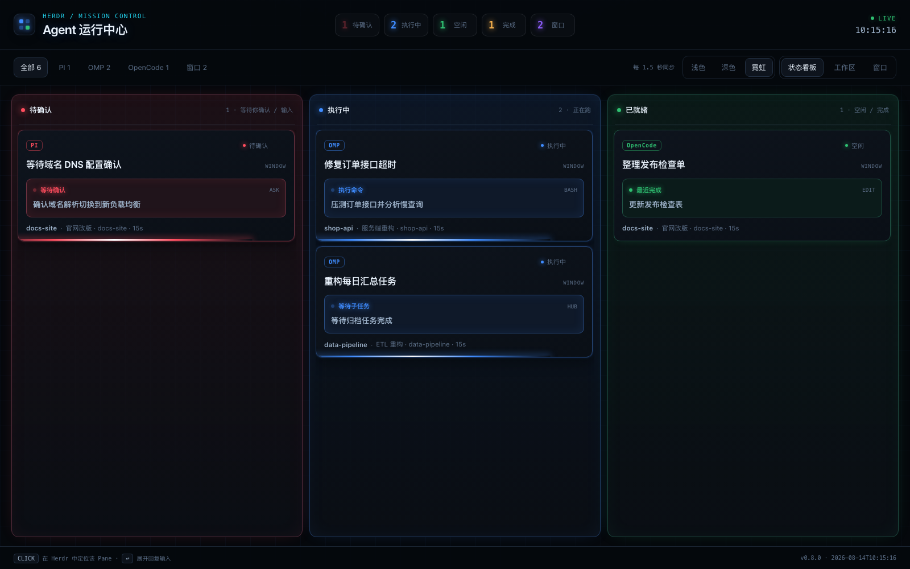
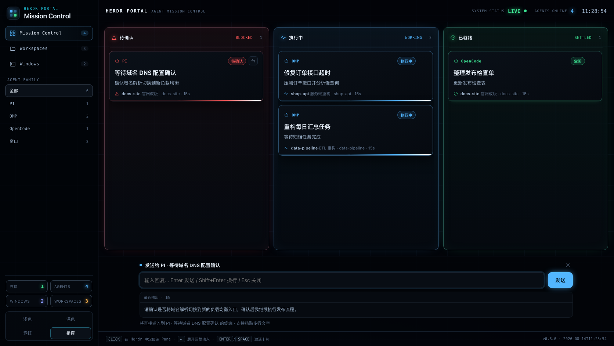
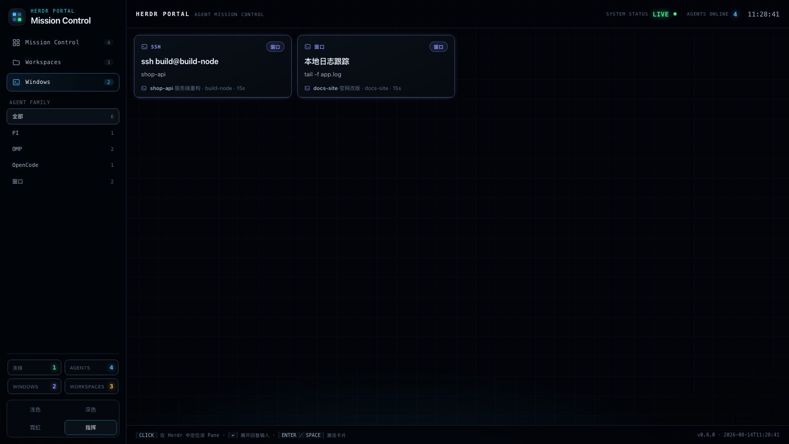
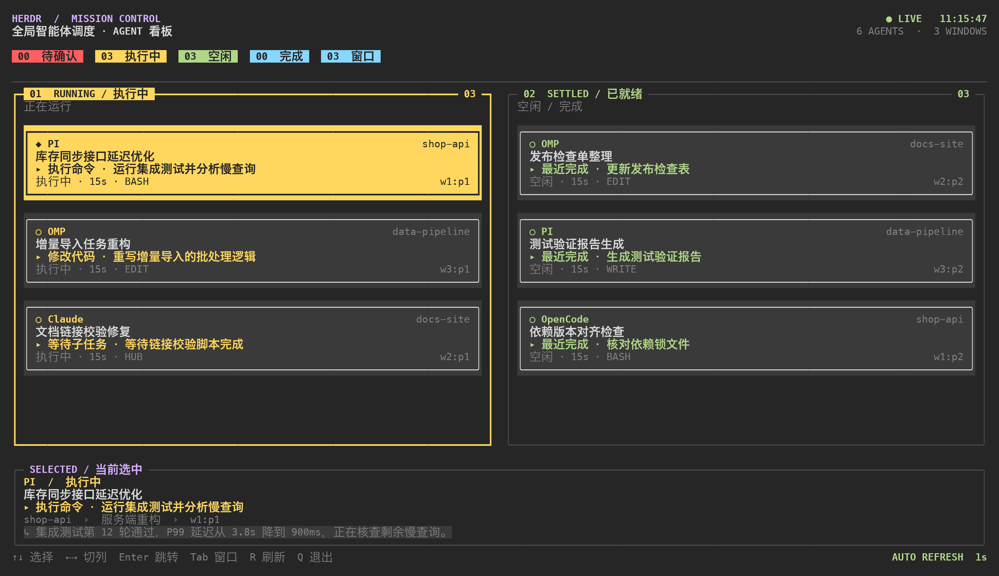

# herdr-portal

**English** · [简体中文](README.zh-CN.md)



**Mission control for every Herdr agent.** One plugin aggregates every workspace / tab / pane in your Herdr session into a single live board, in two forms:

- **TUI board** — press **`Ctrl+B` then `A`**: three agent columns plus a separate window view, `Enter` lands you in the session
- **Web big-screen** — press **`Ctrl+B` then `Shift+A`**: four themes (command / neon / light / dark), structured progress, click a card to focus Herdr and raise its terminal, reply to an agent from the browser, recent output rendered as Markdown

   

## Why `Ctrl+B` `A` is the way to use it

The TUI opens as a Herdr popup pane, so the whole round trip is two keystrokes and never leaves the keyboard:

```
Ctrl+B  A        board opens over your current pane
↑ ↓ ← →          pick the agent that needs you (or just click it)
Enter            jump to that pane — the board closes itself on the way out
```

No window switching, no mouse hunt, no "which tab was that agent in again". `Ctrl+B` is Herdr's prefix, `A` is the board, and `Shift+A` is the same board as a web dashboard. Because the board closes the instant it jumps, the gesture is one motion instead of a mode you have to exit.

## Preview

**Web board** (default *command* theme): left command rail, system status bar, red/blue/green status columns, terminal status strip. The "waiting" column hides itself when nothing is blocked.



**Reply from the web**: click a card to focus Herdr, click `↩` on the card to expand the reply area — an input box plus that agent's recent output, rendered as Markdown and following live.



**Window view**: plain SSH / shell terminals live in their own view instead of crowding the agent board.



**TUI board** (real curses render, redacted demo data): nothing is blocked here, so the board collapses to two columns — *running* and *ready* — while keeping the real selection state, detail bar, and key hints.



## Features

- **Every agent state in one place** — waiting / running / idle / done, plus plain windows
- **Agent detection** — PI, OMP, Claude, Codex and 20+ others
- **Structured live progress** — current phase (running a command / editing code / waiting on a subtask / waiting for you…) plus the execution title, tool type, and last-active time
- **Dynamic waiting column** — zero footprint until an agent stops for you (approval or question), then it appears first and blinks in the header counters
- **Click to land** — web or TUI, clicking a card switches Herdr to that workspace/tab/pane and raises the terminal window that hosts Herdr (Ghostty, iTerm2, Terminal, kitty, Alacritty, WezTerm… all detected)
- **Keyboard *and* mouse in the TUI** — full keyboard control, plus click to select, click again (or double-click) to jump, click a column to switch to it
- **Reply to an agent from the web** — text goes straight to that agent's terminal (`agent prompt` when idle, simulated keystrokes while it runs), multi-line paste included
- **Sturdy** — the web service runs independently of Herdr (closing the popup does not drop it), reconnects while keeping the last data, preserves scroll position, and skips redraws with a data fingerprint

## Quick start

```bash
herdr plugin install loofare/herdr-portal
```

Then bind the keys in `~/.config/herdr/config.toml`:

```toml
[[keys.command]]
key = "prefix+a"            # Ctrl+B then A
type = "plugin_action"
command = "herdr-portal.open-board"
description = "open global board TUI"

[[keys.command]]
key = "prefix+shift+a"      # Ctrl+B then Shift+A
type = "plugin_action"
command = "herdr-portal.open-web"
description = "open web portal"
```

Finish with `herdr server reload-config` and press **`Ctrl+B` `A`**.

> `prefix` is Herdr's prefix key, `Ctrl+B` by default. If you remapped it, substitute your own prefix — the plugin only cares about the `+a` half.

## TUI guide

**`Ctrl+B` `A`** opens the **agent board** (three columns):

- **Dynamic columns** — with nothing blocked you get *running* and *ready*; the moment an agent stops for you, the waiting column appears and takes first place
- **Virtual scrollbar** — a column with more cards than fit grows a colored scrollbar whose thumb size and position track the list
- **Structured cards** — title first (the headline) → `▸ phase · execution title` → status/tool/pane id; the driving framework (omp / pi / …) is demoted to a lowercase tag on the card's top-right border, with the workspace sitting beside the title
- **Detail bar** (when the terminal is tall enough) — current phase, execution title, location path, recent output digest
- **`Enter` lands** — jumps to the pane and **closes the board immediately**, leaving the session you aimed at in front of you; on failure the board stays and tells you why
- **Window view** — `Tab` or `v` switches to the SSH/shell grid, press again to switch back
- **Reclaim idle panes** — `X` (or the `⌫ 释放闲置` button in the header) opens the reclaim panel; tick the panes you want gone and press `Enter` twice to close them and free the resources
- **Rename in place** — `E` opens the rename panel; `Tab` cycles between pane title / tab name / workspace name, `Enter` saves
- **Open a new slot** — `N` creates a tab in the selected card's workspace; `s` / `S` splits a new pane to the right of / below the selected pane. Both inherit the selected card's directory, then jump you there and close the board

### Mouse

The TUI is keyboard-first but never keyboard-only:

| Gesture | Effect |
| --- | --- |
| Click a card | Select it (instant detail bar update) |
| Click the selected card again, or double-click any card | Jump to that pane and close the board |
| Click a column's empty area | Make that column active |
| Click `⌫ 释放闲置` in the header | Open the reclaim panel (its rows, threshold chip and buttons are all clickable) |
| Click one of the three chips in the rename panel | Switch between pane / tab / workspace |
| Click `＋ 新 Tab` / `⬓ 新 Pane` in the header | Create one in / beside the selected card, jump there and close the board |
| Click `⬆ 更新 vX.Y.Z` in the header (only shown when behind) | Same as `U`: first press warns, second press runs the update in a new tab |
| Anything else | Keyboard shortcuts below, unchanged |

Mouse reporting degrades silently: on a terminal or ncurses build without it, every key still works. The scroll wheel is deliberately not bound — macOS ships ncurses 5.7, which reports wheel-down and pointer motion on the same bit, so binding it would scroll the board whenever the pointer moved.

### Reclaiming idle panes

A permanent `⌫ 释放闲置` button sits in the header; `X` does the same from the keyboard. It **takes over none of the existing keys** — close the panel and everything behaves exactly as before.

The panel lists what is safe to reclaim and says why:

- **Never reclaimed** — agents that are running or waiting on you, the focused pane, the pane hosting the board itself, and any window with a real foreground process (ssh, vim, log tails…). They show up on the *protected* line with their reason.
- **Candidates** — window panes whose foreground is nothing but an idle shell (`静止 Shell`), plus idle/finished agents (marked `⚠`, higher risk, **never preselected**).
- **Quiet time** — the board samples each pane's terminal revision every second and records when it last changed, so "静默 2h" is observed, not guessed (state lives in `~/.cache/herdr-portal/activity.json`).
- **Preselect threshold** — `T`, or the chip in the panel's top-right, cycles `不限 / 5m / 30m / 2h`. It only changes what is ticked by default; the list itself is always complete.
- **Two-step confirm** — the first `Enter` only arms the action (the button becomes *确认释放 N 项*), the second one closes the panes. Applying re-scans first, so anything that woke up in the meantime is skipped.
- **Cascade** — closing a tab's last pane closes the tab, and a workspace's last tab closes the workspace; the panel flags that up front with `连带释放 workspace「…」`.

The web board drives the same engine: the `释放闲置` button in the rail, or `x`.

**Disk cleanup on the side** — the panel's footer carries `磁盘预览 d` / `磁盘清理 D`, handing the disk half to [Mole](https://mole.fit)'s `mo clean`:

- `d` → `mo clean --dry-run` (report only, touches nothing)
- `D` → `mo clean` (the real thing; mo does its own confirmation)
- Both **open a fresh herdr tab**, start the command there, jump you to it and close the board. `mo` is interactive (sudo prompts, full-screen UI), so it belongs in a real terminal — the board launches it and gets out of the way.
- Without `mo` installed the panel says `未找到 mo（Mole）· https://mole.fit` in red and does nothing else. `HERDR_PORTAL_MO_BIN` points at a different binary.

Division of labour: **reclaim frees memory and processes (panes/tabs/workspaces), `mo clean` frees disk (caches, logs, leftovers)**.

### Renaming a pane / tab / workspace

Select a card and press `E` (the panel's chips are clickable too):

| Target | What changes | Empty value |
| --- | --- | --- |
| **Pane 标题** | the card's headline (herdr's pane label, which outranks the terminal title) | saving empty clears the custom title and falls back to the terminal title |
| **Tab 名称** | the tab it lives in, **and the selected pane's title is renamed to match** (other panes in that tab are left alone) | rejected, the panel says so in red |
| **Workspace 名称** | the workspace it lives in | rejected, the panel says so in red |

The field supports `←→` cursor movement, `Backspace` / `Delete`, `Ctrl+U` to clear, and CJK input; `Enter` saves and refreshes the board immediately, `Esc` leaves everything untouched. Names are stripped of control characters, whitespace-collapsed, and capped at 80 characters.

Renaming a tab carries the pane title along because the card headline prefers the pane label: change only one half and the same card ends up showing the new tab name next to the stale pane name. If the pane half fails, the tab rename still stands and the toast says `Pane 标题没跟上（reason）`.

### Version check and guided update

The header subtitle always carries the installed version (`全局智能体调度 · AGENT 看板 · v1.2.0`, read from `herdr-plugin.toml`). When upstream is ahead, an amber `⬆ 更新 vX.Y.Z  U` button appears in the header; `U` does the same from the keyboard:

- **Never blocks** — a background thread reads the upstream `herdr-plugin.toml` version at startup and caches it in `~/.cache/herdr-portal/version.json` (6h TTL). Rendering only reads that cache, so offline or rate-limited simply means no button, never a stalled frame
- **Two presses before anything runs** — the first `U` only says `发现新版 vX.Y.Z（当前 vA.B.C）· 再按一次 U 执行 …`; the second one launches
- **Update path follows the install path** — a `.git` inside the plugin directory means `git pull --ff-only` (which refuses to clobber local work and leaves conflicts to you); otherwise `herdr plugin install github:<repo>`
- **Runs in a real terminal** — the command gets its own herdr tab, then the board jumps you there and closes. Auth prompts, conflicts and interactive output stay yours
- **Up to date / unknown** — `已是最新 · vX.Y.Z` and `查不到最新版本 · reason`, both side-effect free

Environment overrides: `HERDR_PORTAL_REPO` (default `loofare/herdr-portal`), `HERDR_PORTAL_BRANCH` (default `main`), `HERDR_PORTAL_VERSION_TTL` (seconds, default 21600).

## Key reference

### TUI

| Key | Action |
| --- | --- |
| `↑ ↓ ← →` / `hjkl` | Move between cards / columns |
| `Enter` | Jump to the pane and close the board |
| `Tab` / `v` | Agent board ↔ window view |
| `1-3` | Jump straight to a column |
| `r` | Refresh now |
| `x` | Open the reclaim panel |
| `e` | Rename the pane title / tab / workspace |
| `n` / `N` | New tab in the selected card's workspace (inherits its cwd) |
| `s` / `S` | New pane right of / below the selected pane (inherits its cwd) |
| `u` / `U` | Check the version; press again to run the update command |
| `q` / `Esc` | Close the board |

Inside the reclaim panel: `↑↓` move · `Space` toggle · `A` all · `N` none · `T` preselect threshold · `R` rescan · `d`/`D` disk preview / clean (mo clean) · `Enter` release (twice) · `Esc` back

Inside the rename panel: `Tab` switch target · `←→` move the cursor · `Ctrl+U` clear · `Enter` save · `Esc` cancel

### Web

| Action | Effect |
| --- | --- |
| Click a card | Focus Herdr on that pane and raise the terminal window |
| Click `↩` on a card | Expand the reply area (input box + recent output) |
| `Enter` / `Shift+Enter` / `Esc` | Send / newline / collapse the reply area |
| `x` / *释放闲置* in the rail | Open the reclaim panel (typing in the composer never triggers it) |
| Bottom-left *light / dark / neon / command* | Switch theme (command by default, choice remembered) |
| *Board / Workspaces / Windows* | Switch view |

## Use cases

- **Watching parallel projects** — several agents running in different workspaces; the board shows who is working and who is waiting, and one keystroke or click puts you there
- **Approving and replying remotely** — when an agent blocks on a permission or a question, the waiting column pops up and you can answer from the web input without going back to the terminal
- **Big-screen supervision** — park the web board on a second display or tablet; progress scrolls live and the workspace view groups by project
- **Window overview** — SSH sessions and log tails stay in the window view instead of mixing with agent state

## Environment variables

| Variable | Effect |
| --- | --- |
| `HERDR_PORTAL_PORT` | Web port (default 8787) |
| `HERDR_PORTAL_NO_FRONT=1` | Do not raise the terminal window when a card is clicked |

Service control: `python3 board/daemon.py start|stop|restart|status` (the plugin starts the web service on demand; logs live in `~/.local/state/herdr-portal/server.log`).

## Local development

```bash
herdr plugin link /path/to/herdr-portal
herdr server reload-config
```

Layout:

```
board/
  tui.py          # curses TUI board (keyboard + mouse)
  collect.py      # collects herdr snapshots + parses sessions
  server.py       # local web service
  daemon.py       # service supervisor (runs detached from the Herdr popup)
  web/            # web frontend (vanilla JS, zero dependencies)
scripts/
  open-board.sh   # open the TUI (plugin pane overlay)
  open-web.sh     # start the web service and open/reuse a browser tab
```

## Requirements

- herdr 0.7+
- Python 3.9+ (bundled on macOS, install it on Linux)
- A browser for the web big-screen (Chrome / Safari / Edge all fine)

## License

[MIT](LICENSE)
